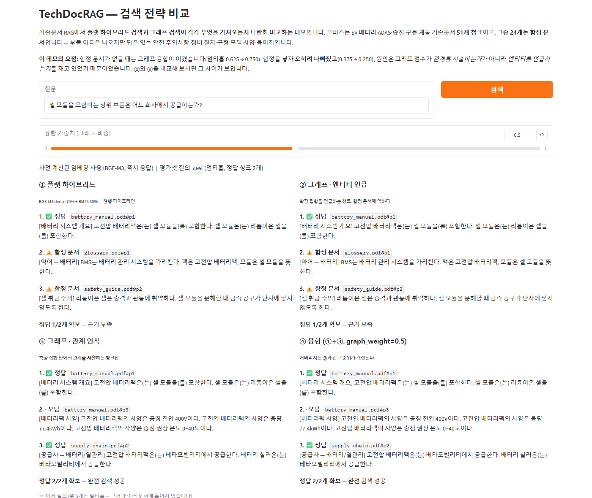

# TechDocRAG — 멀티모달 기술 문서 RAG

PDF 기술 문서(텍스트 + 표 + 다이어그램)를 업로드하면 자연어 질문에 **페이지 이미지와 함께** 답변하는 RAG 시스템.

## 검색 전략 비교 데모 (LLM 불필요, 무료 CPU에서 동작)



같은 질문에 **플랫 하이브리드 · 그래프(엔티티 언급) · 그래프(관계 인식) · 융합**이 각각 무엇을
가져오는지 나란히 보여준다. 코퍼스 72개 중 33개는 **함정 문서**다 — 부품 이름은 나오지만 답은 없는
안전 주의사항·정비 절차·구형 모델 사양·용어집.

위 화면이 이 데모의 요점이다. 멀티홉 질의에서 플랫 하이브리드와 엔티티 언급 그래프는 근거 2개 중
1개만 찾고 top-3에 함정 문서를 2개 올리는 반면, **관계 인식 그래프만 2개를 다 찾는다.**

실행: `python space_app.py` · 배포 절차: [`DEPLOY_SPACE.md`](DEPLOY_SPACE.md)

### GraphRAG vs 플랫 하이브리드 — 실측 (2026-07-30, 3차)

평가셋을 **그래프에서 생성**해(135문항 = 단일홉 97 + 멀티홉 38) 검정력을 확보하고,
전략 차이를 **McNemar 정확검정**으로 판정했다. top-3, dense=BAAI/bge-m3, 지표는 `full_hit`
(정답을 구성하는 청크가 **전부** 상위 k에 들어야 1점 — 멀티홉은 근거가 다 모여야 답이 된다).

| 전략 | 전체 | 단일홉 | **멀티홉** |
|---|---:|---:|---:|
| hybrid_flat (당시 배합비 dense 0.7 + BM25 0.3) | 0.733 | **1.000** | 0.053 |
| graph_linked (엔티티 언급 점수) | 0.644 | 0.866 | 0.079 |
| **graph_rel (관계 인식 점수)** | 0.711 | 0.876 | **0.289** |
| **fused_rel (융합, w=0.2)** | **0.793** | **1.000** | 0.263 |

**멀티홉에서 그래프가 플랫을 이긴다: 0.053 → 0.289, 불일치 0:9, McNemar p=0.0039(유의).**
반대로 **단일홉에서는 그래프가 진다**(1.000 vs 0.876) — 답이 한 청크에 있으면 어휘 검색으로
충분하고 그래프는 노이즈만 더한다. 전체로 합치면 차이가 사라진다(p=0.66). 즉 **"GraphRAG가
낫다"는 뭉뚱그린 주장은 이 실험에서 성립하지 않고, 이득은 멀티홉에 한정된다.**
그래서 실무 답은 융합(`fused_rel`)이고, `graph_weight`는 **홀드아웃 dev에서 골랐다**(0.2).

**측정 방법 자체가 결론을 바꾼 사례 두 건**(자세히는 [`graph_rag/NOTES.md`](graph_rag/NOTES.md)):
- 단위테스트가 생성기 결함을 잡아 멀티홉을 51 → **38문항으로 줄였더니 검정력이 오히려 생겼다**
  (p 0.238 → 0.0039). 빠진 13문항은 **시드 단어 하나로 플랫 BM25가 풀던 것들**이라 그래프의
  이점을 가리고 있었다.
- "유의하지 않음"과 **"판정불가"**를 구분한다 — 불일치 쌍이 6개 미만이면 완전히 쏠려도
  p<0.05가 불가능하므로 그건 결론이 아니라 잴 힘이 없다는 뜻이다.

재현: `python run_graph_eval.py --auto --holdout` (결정적 — 랜덤 없음)
판단의 이력(왜 그렇게 설계했나): [`graph_rag/DECISIONS.md`](graph_rag/DECISIONS.md)

### KnowledgeOps — 실문서(공공조달 RFP 96건)로 옮겨 재측정

위 실험은 합성 코퍼스였다. 그 가정을 걷어내고 **실제 HWP 원본 96건**(각 4만~10만 자)으로
같은 비교를 다시 했다. 관계는 더 이상 주어지지 않고 **직접 추출(IE)**한다.

| | 합성 | **실문서** |
|---|---:|---:|
| 청크 | 72 | **7,863** |
| 방해 문서 | 46% | **90%** |
| 관계 | 73(생성 규칙) | **1,069(IE 추출)** |

**실측 (top-3, BGE-M3+BM25, full_hit)**

| 전략 | 전체 | 단일홉 | **멀티홉** |
|---|---:|---:|---:|
| hybrid_flat | 0.398 | 0.593 | **0.000** |
| graph_rel | 0.364 | 0.364 | **0.362** |
| **fused_rel** | **0.545** | **0.652** | 0.328 |

**합성의 결론이 뒤집혔다.** 합성에서는 "dense가 그래프의 이점을 상당히 흡수한다"였는데
(멀티홉 hybrid 0.053), **실문서에서는 hybrid가 0.000이다**(불일치 0:21, p<0.0001).
질의는 기관명으로 시작하는데 예산이 적힌 청크에는 기관명이 없고 의미적으로도 가깝지 않다 —
그래프가 없으면 멀티홉이 **원리적으로 불가능**하다. 실험 조건이 결론을 얼마나 좌우하는지
보여주는 사례다. (반복 검색이 이득 없다는 결론은 양쪽에서 동일하게 유지됐다.)

**IE 품질이 곧 상한이다 — 그래서 감사한다.** 추출 직후 표본 20건을 눈으로 읽었더니 절반이
오탐이었다("사업금액 20억원 **미만** 계약은 대기업 제한"을 예산으로, "제본 및 **스프링** 사용"을
프레임워크로). 문맥 가드(라벨 근접 + 부정 배제)로 예산 표본 6/6까지 올렸고, 커버리지가
88→49건으로 준 것은 감수했다 — **틀린 관계는 gold를 오염시켜 평가 전체를 무의미하게** 만들기
때문이다.

### IE 전수 감사 — "정밀도를 곱한 상한"을 실측으로 바꿨다 (6차)

위 문단이 남긴 단서를 없애려고 감사를 제대로 했다. 계획은 "표본을 늘려 신뢰구간을 붙이자"였는데,
**착수 전에 모집단을 세어 보니 전수가 됐다.** 평가에 실제로 쓰인 속성 관계는 120개뿐이다
(HAS_BUDGET 49 · HAS_PERIOD 71). 853개인 REQUIRES는 176문항 중 5문항에만 관여한다.
전수를 셀 수 있으면 세는 게 낫다 — 추정이 아니게 되고, 무엇보다 **어느 관계가 오탐인지 특정**돼
그 문항을 골라낼 수 있다.

| 관계 | 방식 | 감사 직후 | **가드 후** |
|---|---|---:|---:|
| HAS_BUDGET | 전수 49 | 0.959 (47/49) | 0.959 |
| HAS_PERIOD | 전수 71 → 53 | **0.437** (31/71) | **0.981** (52/53) |
| REQUIRES | 표본 50/853 | 0.880, 95% CI [0.762, 0.944] | 동일 |

**⚠️ 내가 감사한 건 내가 고친 것뿐이었다.** 5차에서 "예산 표본 6/6 정확"을 근거로 IE 품질이
잡혔다고 적었는데, 문맥 가드를 붙인 것도 예산이고 감사한 것도 예산이었다. 기간은 가드도 감사도
없이 통과했고 전수로 세니 절반 이상이 오탐이었다 — 보고 제출기한 9 · 서류 유효기간 8 ·
보안교육 이수기한 7 · 하자보증기간 5 · 내부 일정 5 · 법정 이행기한 5. 전부 "기간처럼 생긴
다른 기간"이다. **표본 감사는 무엇을 표본으로 삼을지에서 이미 결론을 좌우한다.**

**정화 후 재집계 — 상한이 아니라 하한이었다.** 오탐 관계에서 유도된 문항을 걸러내고
(2-hop은 다리가 틀려도 걸러진다) 176 → **105문항**으로 다시 집계했다. 검색은 다시 돌리지
않았다(러너가 문항별 정오를 남기도록 고쳐 뒀다).

| 전략 | 전체(전→후) | 단일홉 | 멀티홉 |
|---|---|---|---|
| hybrid_flat | 0.398 → 0.638 | 0.593 → 0.882 | **0.000 → 0.000** |
| graph_rel | 0.364 → 0.495 | 0.364 → 0.474 | 0.362 → **0.552** |
| **fused_rel** | 0.545 → **0.838** | 0.652 → **0.934** | 0.328 → 0.586 |

전 전략이 올랐다. 오탐 문항은 gold가 엉뚱한 청크라 검색기가 체계적으로 틀렸고 그게 지표를
눌러 온 것이다. **나는 이 수치를 "과대평가된 상한"이라고 적어 뒀는데 실제로는 "과소평가된
하한"이었다** — 한계를 적을 때도 방향을 확인해야 한다.

그리고 **핵심 결론은 오염 위에 서 있지 않았다**: 멀티홉에서 hybrid는 정화 후에도 0.000
(29문항 전부 실패), 그래프 0.552, 불일치 **0:16**, p<0.0001.

```
python run_audit.py    # 정밀도 → 정화 → 재집계 → 정화 후 검정
```

판정 라벨은 근거 문장과 함께 `output/audit_labels.json`에 고정돼 있다(누구든 다시 볼 수 있게).

### Neo4j AuraDB로 실행 검증하기

이 저장소는 Graph DB 백엔드를 셋 가진다 — in-memory(순수 구현) · Kuzu(임베디드 Cypher) ·
Neo4j(서버 Cypher). **개발 환경에 Docker도 Java도 없어** 로컬 Neo4j는 못 띄우고, 그래서
그동안 "Neo4j는 코드만 있고 실행 미검증"을 한계로 적어 왔다. AuraDB 무료 인스턴스는 설치가
필요 없어서 그 경로를 열어 뒀다.

```powershell
# 1) console.neo4j.io 에서 AuraDB Free 인스턴스 생성 (카드 등록 불필요)
#    생성 직후 한 번만 보여주는 접속 정보 파일을 저장한다
# 2) 환경변수로 넣는다
$env:NEO4J_URI      = "neo4j+s://xxxxxxxx.databases.neo4j.io"
$env:NEO4J_PASSWORD = "발급받은-비밀번호"
# 3) 검증
python verify_neo4j.py            # 합성 코퍼스(작음)
python verify_neo4j.py --real     # 실문서 그래프(관계 1,051개)
```

검증 내용은 "연결됐다"가 **아니다**. 그건 아무것도 증명하지 않는다.
같은 그래프에서 **세 백엔드가 같은 답을 내는지**(`expand` 최단 홉수 · `neighbors` 인접 관계)를
확인하고 하나라도 다르면 그 자리에서 실패한다.

`tests/test_neo4j.py`는 접속 정보가 없으면 서버 테스트를 **skip**한다 — 안 돌린 걸 돌린 척하지
않기 위해서다. 설정 해석·쿼리 안전성(가변길이 상한은 Cypher에 문자열 보간되므로 int 강제)·
조용한 폴백 금지는 서버 없이도 검증된다.

> ⚠️ 접속 정보 파일에는 **비밀번호가 평문**으로 들어 있다. 저장소에 커밋하지 말 것
> (`.gitignore`에 `Neo4j-*.txt`·`.env` 추가돼 있다).

### 기간 문맥 가드 — 사후 보정이 필요 없게 만들었다 (7차)

위에서 드러난 기간 정밀도 0.437을 닫았다. 예산과 같은 처방(라벨 뒤 30자 안의 기간만 인정)에
두 가지를 더 걸었다: 상용구 '적정 사업기간 산정기준' 배제, 그리고 일(日) 패턴을 열면서 생긴
새 오탐(`2024년 12월 **31일까지**` → "31일짜리 사업") 차단.

**내가 붙인 라벨에 가드를 맞추지 않으려고 문서를 반으로 갈랐다** — 짝수(dev)에서만 규칙을
도출하고 홀수(test)는 한 번도 보지 않았다.

| | 가드 전 | 가드 후 |
|---|---:|---:|
| 정밀도 | 0.437 | **0.981** |
| dev(규칙 도출) | 0.303 | 1.000 (25/25) |
| **test(홀드아웃)** | 0.553 | **0.964** (27/28) |
| 정확한 관계 수 | 31 | **52** |

**예산 가드는 재현율을 대가로 냈는데(88→49) 기간은 둘 다 올랐다.** 결함의 구조가 달랐다 —
예산은 *라벨 밖 금액을 버리는* 문제, 기간은 *문서 안의 정답을 놓치고 엉뚱한 걸 집는* 문제였다.
홀드아웃에 남은 오탐 1건('위탁사업 기간이 종료되면 … 5일 이내 개인정보를 파기')은
**고치지 않았다** — 고치면 그건 더 이상 홀드아웃이 아니다.

**검색 재측정 (평가 134문항)**

| 전략 | 전체 | 단일홉 | 멀티홉 |
|---|---:|---:|---:|
| hybrid_flat | 0.634 | 0.850 | **0.000** |
| graph_rel | 0.582 | 0.570 | **0.618** |
| **fused_rel** | **0.851** | **0.920** | 0.647 |

멀티홉 hybrid는 **또 0.000**이다 — 합성 0.053 → 실문서 0.000 → 실문서+가드 0.000,
세 조건에서 재현(불일치 0:21, p<0.0001). **정화가 거의 필요 없어졌다**: 문항 134 → 131,
멀티홉 제외 **0건**(6차엔 71문항을 걷어내야 했다). 사후 보정이 필요 없는 데이터가 사후 보정보다 낫다.

⚠️ **6차에서 "덤"이라 적은 유의성은 사라졌다.** 정화 후 [전체] hybrid vs graph가 p=0.0400이었는데
가드 후에는 **p=0.4270(유의하지 않음)**이다. 문항 구성이 바뀌면 사라지는 유의성이었으니
전략 간 차이가 아니라 그 문항 집합의 성질이었다. 주 결론은 세 조건에서 재현됐고 덤은 한 번에 무너졌다 —
**부수 결과는 주 가설만큼 검증되지 않았다.**

**재현 절차** (문서는 저장소에 없다 — 경로만 바꾸면 어떤 HWP 묶음에서도 돈다)

```
# 1) 문서 → 지식그래프. `기관명_사업명.hwp` 규약만 지키면 된다
python build_rfp_graph.py --src "경로/to/hwp_dir" --audit HAS_BUDGET

# 2) 검색 전략 비교 + 통계 검정 (결정적 — 재실행하면 같은 값)
python run_real_eval.py

# 3) 4탭 콘솔: 문서→그래프 · 검색 비교 · 평가 리포트 · IE 감사
python knowledgeops_app.py
python knowledgeops_app.py --demo   # HWP 없이 합성 코퍼스로 동작 확인
```

RFP 원본(약 164MB)은 저장소에 넣지 않았다. 대신 **측정 결과 JSON은 커밋해 뒀으므로**
문서가 없어도 리포트 탭과 위 수치는 확인할 수 있고, 콘솔은 `--demo`로 뜬다.

정직한 한계: 멀티홉이 **34문항**이라 절대 표본이 작다 · REQUIRES는 표본 감사라 개별
오탐을 특정하지 못해 거기서 유도된 **멀티홉 5문항은 정화되지 않았다** · 라벨은 판정자 1인 기준이
섞여 있다(경계 사례는 근거를 남겨 재검증 가능) · 기간을 **날짜 범위로만** 적은 문서는 이제 아예 빠진다(표현형 한계) · 요구 기술은 사전 매칭이라
사전 크기가 재현율 상한 · **Neo4j는 코드만 있고 실행 미검증**(Kuzu 임베디드 Graph DB로 Cypher
탐색은 검증됨).

## 아키텍처

```
PDF (텍스트 + 표 + 다이어그램)
  ↓  PyMuPDF + pdfplumber
PageChunk → BGE-M3 (1024-dim) → ChromaDB
            BM25Okapi          → pkl 인덱스
  ↓  하이브리드 검색 (Dense 90% + BM25 10% — dev 스윕으로 정함, 아래 참조)
Top-K RetrievedChunk
  ↓  Qwen2.5-VL 7B (Ollama) / Rule-based 폴백
구조화된 답변 + 출처 페이지 이미지
```

## 기술 스택

| 역할 | 기술 |
|------|------|
| PDF 파싱 | PyMuPDF (페이지 이미지 200 DPI) + pdfplumber (표 추출) |
| 텍스트 임베딩 | BAAI/bge-m3 (1024-dim, 한/영 다국어) |
| 키워드 인덱스 | BM25Okapi (한국어 정규식 토크나이저) |
| 벡터 스토어 | ChromaDB PersistentClient (cosine space) |
| 하이브리드 검색 | Dense 90% + BM25 10% 앙상블 (배합비는 dev 스윕으로 결정) |
| Vision LLM | Qwen2.5-VL 7B via Ollama (Rule-based 폴백) |
| API 서버 | FastAPI + uvicorn |
| 데모 UI | Streamlit |
| 배포 | Docker + docker-compose |

## 노트북 구성

| 노트북 | 내용 |
|--------|------|
| `01_document_processing.ipynb` | PyMuPDF 이미지 변환 + pdfplumber 표 추출 + PageChunk 설계 |
| `02_multimodal_embedding.ipynb` | BGE-M3 임베딩 + BM25 인덱스 + ChromaDB 인덱싱 |
| `03_rag_pipeline.ipynb` | 하이브리드 검색 + Qwen2.5-VL 답변 생성 + Hit Rate/MRR 평가 |
| `04_full_integration.ipynb` | FastAPI 서버 + Streamlit UI + 벤치마크 + Docker 구성 |

## API 엔드포인트

```
GET  /health    서버 상태 및 인덱스 현황
POST /ingest    PDF 업로드 → 자동 인덱싱
POST /query     하이브리드 검색 + Vision LLM 답변
```

### 예시

```bash
# 헬스체크
curl http://localhost:8000/health

# PDF 인덱싱
curl -X POST http://localhost:8000/ingest \
  -F "file=@data/docs/ev_battery_manual.pdf"

# 질문
curl -X POST http://localhost:8000/query \
  -H "Content-Type: application/json" \
  -d '{"question": "배터리 팩 공칭 전압은?", "top_k": 2}'
```

## 실행 방법

### 로컬 (conda 환경)

```bash
conda activate multimodal_rag

# FastAPI 서버
cd app && uvicorn main:app --port 8000 --reload

# Streamlit UI (별도 터미널)
streamlit run app/streamlit_app.py
```

### Docker

```bash
docker-compose up --build
```

Swagger UI: http://localhost:8000/docs

## 벤치마크 결과

하이브리드 검색 응답시간 (25회 측정, BGE-M3 + BM25):

| 지표 | 값 |
|------|----|
| 평균 | ~15 ms |
| P50 | ~12 ms |
| P95 | ~28 ms |

실시간 검색 기준(200ms) 대비 **10배 이상 여유**.

## RAG 생성 품질 평가 (RAGAS 스타일)

검색 품질(Hit Rate/MRR)을 넘어, **생성 답의 품질**을 RAGAS 지표로 수치화한다 — 라이브러리 래핑이
아니라 지표를 직접 구현(`ragas_eval/`). 순수 계산부는 오프라인 단위테스트되고, LLM 판정이 필요한
지표는 judge를 주입한다(테스트는 stub, 실측은 무료 Gemini).

| 지표 | 의미 | 계산 |
|---|---|---|
| answer_correctness | 답 vs 정답 토큰 F1(사실성) | 순수 |
| context_precision | 관련 컨텍스트가 상위에 있는가 | 순수(순위 가중) |
| context_recall | 정답 진술이 컨텍스트로 뒷받침되는 비율 | LLM judge |
| faithfulness | 답의 주장이 컨텍스트로 뒷받침되는 비율(환각 역지표) | LLM judge |

```bash
python run_ragas.py            # 결정적 stub judge(키 불요, 파이프라인 동작 시연)
python run_ragas.py --gemini   # 무료 Gemini judge로 실측(GEMINI_API_KEY)
python -m pytest tests/test_ragas.py   # 순수 지표 단위테스트
```

## 환경 설정

```bash
conda create -n multimodal_rag python=3.11 -y
conda activate multimodal_rag
pip install -r requirements.txt
```

Ollama Vision LLM (선택):
```bash
ollama pull qwen2.5vl:7b
```

---

## 하이브리드 배합비 — 재고, 옮기고, 내 결론까지 다시 확인했다 (2026-08-10)

`graph_weight`와 agentic 라운드는 dev에서 골랐으면서 **검색의 토대인 dense/BM25 배합비 0.7/0.3은
한 번도 재지 않았다.** 코드에 박혀 있었을 뿐이다. 같은 규칙으로 다시 쟀다.

```bash
python run_hybrid_weight.py            # 실문서 RFP 코퍼스
python run_hybrid_weight.py --synthetic
```

가중합은 `w·dense + (1-w)·bm25` 라서 질의별 성분 점수를 한 번만 계산해 두면 11개 후보를
재인코딩 없이 재랭킹할 수 있다(BGE-M3 인코딩은 코퍼스 1회로 끝난다).

### 결과 — 0.7은 최적이 아니었다

| 실문서 RFP (7,863청크·134문항, k=3) | full_hit | MRR |
|---|---:|---:|
| 코드 고정값 `w=0.7` (test) | 0.627 | 0.580 |
| **dev가 고른 `w=0.9` (test)** | **0.731** | **0.697** |

McNemar **p=0.0156**, 7건 개선·**0건 악화**. 가중치는 dev(67문항)에서만 고르고 한 번도 보지 않은
test(67문항)로 보고했다. 그래서 `DENSE_WEIGHT`를 0.9로 옮겼다(테스트 117개 통과).

### 그리고 더 중요한 것 — 베이스라인이 세지자 내 방법의 이득이 줄었다

튜닝한 베이스라인으로 전략 비교를 다시 돌렸다(`run_real_eval.py --dense-weight`).

| test 67문항 | 배합비 0.7 | 배합비 0.9 |
|---|---|---|
| hybrid_flat full_hit (all) | 0.634 | **0.731** |
| hybrid_flat → fused_rel | +0.224 (p 0.0001) | **+0.104 (p 0.0156)** |
| dev가 고른 graph_weight | 0.5 | **0.3** |
| hybrid_flat → graph_rel (all) | −0.052 (유의하지 않음) | **−0.149 (유의)** |

융합의 우위는 살아남았지만 **이득의 크기가 절반 이하로 줄었다.** 예전 이득 중 상당 부분은
그래프가 좋아서가 아니라 베이스라인을 덜 튜닝한 몫이었다. dev가 고른 그래프 비중이 0.5에서
0.3으로 내려간 것도 같은 이야기다. 멀티홉에서는 여전히 그래프가 결정적이다
(하이브리드 0.147 대 융합 0.529~0.676). **"그래프가 이긴다"보다 "멀티홉에서만, 그리고 생각보다
작게 이긴다"가 정확한 문장이다.**

### 한계

합성 코퍼스(test 8문항)로도 돌렸지만 불일치 쌍이 1개뿐이라 `min_detectable_discordant` 기준
6쌍에 못 미쳐 **판정 자체가 불가능**하다 — 근거는 실문서 쪽 하나다. 또 이 배합비는 BM25를
max 정규화한 스케일 위의 값이라, 정규화를 바꾸면 최적값도 옮겨 간다. "의미 90%, 어휘 10%"라는
의미론적 해석으로 읽으면 안 된다.

## 컴포넌트 장애 대응 — dense·BM25가 하나씩, 그리고 둘 다 죽으면 (2026-09-07)

면접에서 "BM25/BGE-M3 중 하나가 죽으면 어떡하냐"는 질문에 코드에 없는 장애 대응을
그 자리에서 지어내 답한 게 발단이다. 실제로 만들고 재는 것으로 갚았다.

`HybridRetriever.score()`(`graph_rag/retrieval.py`)에 컴포넌트별 `try/except`와 3단
축소 운영을 추가했다 — dense 실패 시 BM25 단독, BM25 실패 시 dense 단독, **둘 다
실패하면 사전 계산 없이 원문 청크를 그 자리에서 스캔해 질의 토큰 겹침 수로 점수화하는
최후 수단**(`_keyword_scores`)까지 떨어진다. 서빙 코드(`app/retriever.py`)에도 같은
로직을 반영했다.

```bash
python run_failure_bench.py   # 실문서 RFP test 67문항, 같은 HybridRetriever를 런타임 몽키패치로 고장냄
```

| 조건 (test 67문항, k=3) | full_hit | MRR | normal 대비 (McNemar) |
|---|---:|---:|---|
| normal (dense 0.9 + BM25 0.1) | **0.731** | 0.697 | — |
| dense_down → BM25 단독 | 0.612 | 0.450 | delta −0.119, **p 0.0078**(유의) |
| bm25_down → dense 단독 | 0.687 | 0.684 | delta −0.045, p 0.375(유의하지 않음) |
| both_down → 키워드 스캔 | 0.582 | 0.438 | delta −0.149, **p 0.0020**(유의) |

**dense가 이 시스템의 진짜 엔진이다** — BM25 없이(dense 단독)는 정상 대비 손실이 통계적으로
유의하지 않지만(4.5%p, p=0.375), dense 없이(BM25 단독)는 유의하게 나빠진다(11.9%p,
p=0.0078). 배합비 0.9/0.1로 정한 dev 스윕 결과와 정확히 같은 방향이다. **둘 다 죽어도
완전 무응답은 아니다** — 키워드 스캔이 여전히 full_hit 0.582(정상의 80%)를 낸다. "하드코딩된
키워드를 노출한다"던 면접 답변은 틀렸지만, "index 없이도 원문 스캔으로 최소한의 응답은
낸다"는 방향 자체는 맞았던 셈 — 다만 그때는 실측 없이 말했고 지금은 숫자가 있다.

단위 테스트는 라우팅 로직만 스텁 임베더로 빠르게 검증한다(`tests/test_retrieval_failure.py`,
6개, 전체 스위트 117 → **123개**). 실제 품질 수치는 위 실측이 유일한 근거다.

### 한계

이 실측은 "컴포넌트가 예외를 던진다"를 흉내 낸 것이다 — 실제 운영 중 임베딩 서비스가
타임아웃 대신 느려지기만 하는 경우(레이턴시 열화)는 다루지 않는다. `app/retriever.py`의
키워드 폴백은 원문을 ChromaDB에서 읽으므로 ChromaDB 저장소 자체의 장애까지는 못 막는다 —
계산 계층(임베딩·BM25 통계) 장애까지가 방어 범위다.

## 다른 임베더·rerank 단계를 실측으로 붙여봤다 (2026-09-09)

면접(컴앤휴먼)에서 우리와 "다른 모델"을 쓰고 있다는 뉘앙스를 받았는데, 그 자리에서 비교해본
적이 없어 답이 얕았다. 이 프로젝트는 처음부터 줄곧 **BGE-M3(dense) + BM25(sparse)** 조합
하나만 썼다 — 다른 임베더나 rerank 단계를 실제로 붙여서 잰 적이 없었다는 뜻이다. 그래서 세
갈래를 새로 쟀다: ①한국어 특화 임베더(KURE-v1) ②범용 다국어 임베더(multilingual-e5-large)
③이 프로젝트에 없던 rerank 단계(bge-reranker-v2-m3). 프로토콜은 하이브리드 배합비 실험과
동일 — dev에서만 고르고 test로 검정, 짝지은 McNemar.

```bash
python run_model_comparison.py     # 실 RFP test 67문항, 3개 임베더 + rerank 실험
python plot_model_comparison.py    # output/model_comparison.png — 판정불가/유의를 막대에 표시
```


| 비교 (test 67문항, k=3) | full_hit | MRR | vs BGE-M3(McNemar) |
|---|---:|---:|---|
| BGE-M3 + BM25 (현재 기본값, w=0.9) | 0.731 | 0.697 | — |
| KURE-v1 + BM25 (w=0.9, dev와 동일) | 0.731 | **0.734** | delta 0.0, **불일치 4쌍 — 판정불가**(< 검정력 하한 6쌍) |
| multilingual-e5-large + BM25 (dev가 고른 w=1.0, dense 단독) | 0.582 | 0.540 | delta **−0.149, p 0.0063**(유의, 불일치 12쌍) |
| BGE-M3+BM25(top-20) → bge-reranker-v2-m3 rerank → top-3 | 0.746 | **0.813** | delta +0.015, **불일치 3쌍 — 판정불가** |

**정직한 결론 — 두 갈래로 갈린다.**

1. **multilingual-e5-large는 유의하게, 그리고 크게 나쁘다.** dev 스윕이 고른 최적조차 dense
   단독(w=1.0)이었는데도 BGE-M3+BM25 하이브리드에 11.9%p(0.149) 뒤졌고, 이건 표본이 충분해서
   (불일치 12쌍 ≥ 검정력 하한 6쌍, `min_detectable_discordant()`) 우연이 아니라고 말할 수
   있다. **BGE-M3를 처음에 고른 게 근거 없는 선택이 아니었다**는 반증이 됐다 — 범용 다국어
   임베더는 이 한국어 조달문서 코퍼스에서 확실히 밀린다.
2. **KURE-v1과 rerank는 "이겼다"고 말할 수 없다 — 아직은.** 둘 다 MRR은 뚜렷이 올랐다(정답이
   더 상위로 온다는 뜻)지만, 이 프로젝트의 주 지표인 `full_hit`(멀티홉 gold 전부 확보)에서는
   불일치 쌍이 각각 4·3개로 **검정력 하한(6쌍) 미만이다.** `DECISIONS.md` G8에서 이미 정한
   구분을 그대로 적용하면 이건 "차이가 없다"가 아니라 **"이 test 67문항으로는 판정할 힘이
   없다"**는 뜻이다 — 다른 결론이다. 그래서 **기본값(BGE-M3+BM25, rerank 없음)을 바꾸지
   않았다.** MRR 개선은 실재하는 신호일 가능성이 있지만, 그 신호로 프로덕션 기본값을 바꾸려면
   문항을 늘려 검정력부터 확보해야 한다 — 이 프로젝트가 하이브리드 배합비·GraphRAG에서 이미
   거쳐온 순서(G3~G5)와 같다.

**SPLADE(학습된 희소 검색)도 실제로 붙여봤다 — BM25를 유의하게 이겼다.** 처음엔 "한국어 지원이
없어서" 스코프아웃하려 했는데 확인해 보니 틀렸다 — `yjoonjang/splade-ko-v1`(skt/A.X-Encoder-base
기반) 한국어 체크포인트가 있다. `run_splade_comparison.py`를 새로 짜서
`sentence_transformers.SparseEncoder`로 인터페이스를 만들었다(첫 시도는 이 머신의 RAM 부족으로
중간에 죽었고, 다른 프로그램을 정리해 메모리를 확보한 뒤 재실행해 완주했다 — 배치 크기를 8로 낮춘
것도 도움이 됐다).

```bash
python run_splade_comparison.py   # 실 RFP test 67문항, SPLADE 단독·하이브리드 비교
```

| 비교 (test 67문항, k=3) | full_hit | MRR | McNemar |
|---|---:|---:|---|
| BM25 단독 | 0.612 | 0.450 | — |
| **SPLADE 단독** | **0.746** | **0.781** | delta **+0.134, p 0.0039**(유의, 불일치 9쌍) |
| BGE-M3+BM25(w=0.9, 기존 기본값) | 0.731 | 0.697 | — |
| BGE-M3+SPLADE(dev 최적 **w=0.1**, 즉 SPLADE가 90%) | 0.746 | 0.784 | delta +0.015, **불일치 3쌍 — 판정불가**(<6) |

**정직한 결론.** SPLADE 단독이 BM25 단독을 **유의하게** 이겼다(불일치 9쌍 ≥ 검정력 하한 6쌍) —
학습된 희소 표현이 순수 용어빈도보다 이 코퍼스에서 실제로 낫다는, 표본이 충분한 결과다. 흥미로운
지점은 dev 스윕이 고른 최적 배합비가 **w=0.1**이라는 것 — 기존 BM25 하이브리드가 dense 90%를
요구했던 것과 정반대다. dev 곡선을 보면 w=0.1~0.9 구간에서 full_hit이 0.746으로 거의 평평해서,
**SPLADE 혼자서도 이미 기존 하이브리드(BGE-M3+BM25)와 같은 수준의 성능을 낸다.** 다만
BGE-M3+SPLADE 하이브리드가 기존 하이브리드보다 **더** 낫다고 말하려면 불일치 쌍이 3개뿐이라
역시 판정불가다 — "이 코퍼스에서 SPLADE는 BM25보다 확실히 나은 어휘 검색기다"까지는 말할 수
있지만, "그래서 프로덕션 하이브리드를 SPLADE로 바꾸면 더 좋아진다"는 아직 증명되지 않았다.
**기본값은 바꾸지 않았다** — 나머지 세 실험과 같은 이유(G32)다.

### 한계

임베더 비교는 **모두 같은 하이브리드 배합비 그리드(dev 스윕)**로 잰 것이라 "임베더 자체의
실력"과 "그 임베더에 맞는 배합비를 찾았는가"가 섞여 있다 — e5-large가 진 것도 다른 배합비
공식(예: max-정규화가 아닌 다른 스케일)에서는 덜 질 수 있다. rerank는 후보 top-20을 먼저
하이브리드로 뽑은 뒤에만 작동하므로, **1단계(retrieve) 자체가 정답을 top-20 밖으로 떨어뜨린
문항은 rerank가 절대 못 구한다** — rerank가 손댈 수 있는 건 이미 후보군에 든 정답의 순서뿐이다.
이 상한을 실제로 재봤다(`run_rerank_upper_bound.py`): test에서 **full_hit@20 = 0.791**로,
현재 기본값(full_hit@3 = 0.731)보다 겨우 **+6.0%p 높다** — 즉 rerank가 아무리 완벽해도 얻을 수
있는 이득의 최대치가 6.0%p뿐이다. 실제 측정된 rerank 이득(+1.5%p)은 이 6.0%p 여유의 약
25%를 가져간 셈이라, "이득이 작다"는 결과가 rerank 방법 자체의 한계라기보다 **1단계 검색이
이미 상한 가까이 가 있었다**는 뜻에 더 가깝다. test 67문항 중 **14문항(21%)은 top-20에도
정답이 다 안 들어와** rerank로 원리적으로 구제 불가능하다 — 이 문항들을 줄이려면 rerank가
아니라 1단계 검색(임베더·배합비) 자체를 개선해야 한다.
이번 실행은 각 실험을 1회만 돌렸다 — 임베딩·rerank 채점은 결정적이라 재현되지만, "67문항이라는
표본 자체가 작다"는 한계는 반복 실행으로 해결되지 않는다. SPLADE 인코딩은 실행 환경(가용 RAM)에
민감했다 — 다른 프로그램이 메모리를 점유한 상태에서는 배치 크기를 낮춰도 죽을 수 있다는 걸
첫 시도 실패로 확인했다. SPLADE의 nnz(문서당 평균 637/50000)는 BM25보다 훨씬 조밀한 희소
벡터라, "희소 검색"이라는 이름이 같아도 계산·메모리 특성은 다르다.

## 벡터DB 3종 head-to-head — ChromaDB vs Qdrant vs PGVector (2026-09-13 → 09-21 확장)

이 프로젝트를 포함해 저장소 전체의 RAG가 벡터DB로 **ChromaDB 하나만** 써 왔다는 걸
최근 공고(브레인크루 — "VectorDB를 2개 이상 깊게 다뤄본 경험") 요구사항을 훑다가 확인했다.
09-13에 Qdrant를 붙여 2종으로 닫았고, 09-21에 **PGVector**(PostgreSQL 16 + pgvector HNSW)를 더해
3종으로 넓혔다(애자일소다 RAG/Data Engineer 공고가 "Pinecone·Milvus·Qdrant·PGVector 활용 경험"을 명시).
"연결된다"가 아니라 **"같은 데이터·같은 질의에서 같은 답을 내는가, 그리고 얼마나 빠른가"**를 실측했다.

```bash
docker run -d --name pgvector-bench -e POSTGRES_PASSWORD=bench -e POSTGRES_DB=vdb -p 55432:5432 pgvector/pgvector:pg16
python run_vectordb_comparison.py   # output/vectordb_comparison.json
python run_pgvector_ef_sweep.py     # output/pgvector_ef_sweep.json
```

같은 실 RFP 코퍼스(7,863청크)와 같은 질의(134건)를 네 방식에 태웠다: **브루트포스**(numpy 내적, 정답 기준)
· **ChromaDB**(HNSW, 임베디드) · **Qdrant**(HNSW, 로컬 임베디드 모드) · **PGVector**(HNSW, Docker 서버, localhost TCP).

| 지표 (2026-09-21 재실행) | ChromaDB | Qdrant | PGVector(ef_search=40 기본) |
|---|---:|---:|---:|
| recall@20 (브루트포스 대비) | 97.2% | **99.9%** | 94.2% |
| top-1 일치율 (브루트포스 대비) | 94.8% [89.6, 97.5] | **97.0%** [92.6, 98.8] | 95.5% [90.6, 97.9] |
| 검색 지연 중앙값(임베딩 제외, 5회) | **1.02ms** | 24.2ms | 1.21ms* |
| 적재(1회) | 13.8s | 38.7s | **5.4s + HNSW 인덱스 1.8s** |

\* **PGVector는 클라이언트-서버 구조라 localhost TCP 왕복이 지연에 섞여 있다.** Chroma·Qdrant는 프로세스 안에서
도는 임베디드 모드라 세 지연 수치가 같은 조건이 아니다 — 서버형 대 서버형이 아니라는 뜻이다.
top-1 일치율 세 쌍 비교(McNemar)는 전부 **판정불가**다(Chroma-Qdrant p=0.375 · Chroma-PGVector p=1.0 ·
Qdrant-PGVector p=0.73, 불일치 쌍 5~9개로 최소검출 기준 미만).
**재실행 편차**: 09-13 초회는 Chroma recall 97.1%·top-1 96.3%·Qdrant 지연 19.8ms였다. HNSW 그래프 구축이
결정적이지 않고 머신 부하도 달라서 top-1은 1.5%p, Qdrant 지연은 20% 흔들렸다 — 그래서 단발 수치를 순위로
쓰지 않고 위 검정 결과를 기준으로 삼는다.

### PGVector recall을 올리는 손잡이 — `hnsw.ef_search` 스윕

같은 인덱스로 검색 시점 파라미터 하나만 바꿨다(인덱스 재구축 없음, 134질의×5회 중앙값).

| ef_search | recall@20 | 지연 중앙값 |
|---:|---:|---:|
| 10 | **50.1%** | 1.06ms |
| 20 | 87.8% | 1.13ms |
| 40 (기본) | 94.2% | 1.17ms |
| 100 | 97.4% | 1.50ms |
| 200 | 98.5% | 1.93ms |
| 400 | 99.4% | 2.63ms |

`ef_search=10`의 50%는 성능이 아니라 **함정**이다: `LIMIT 20`인데 `ef_search`가 10이면 pgvector는 후보를 10개까지만
탐색하므로 **요청한 20개를 못 채우고 최대 10건만 돌려준다**(recall 상한 50%). `ef_search ≥ LIMIT`가 사실상
필수 조건이다. 기본값 40으로도 recall 94.2%이고, 200으로 올리면 지연 1.65배(1.17→1.93ms)를 내고 Qdrant급(99%) 근처인
98.5%에 닿는다 — recall 요구가 정해지면 그에 맞춰 이 손잡이를 고른다.

**정직한 결론**: 세 벡터DB를 실제로 붙여 비교했다. **이 규모(7,863건)에서는 근사 탐색이 필요 없고**(브루트포스
numpy 0.55ms가 세 ANN 모두보다 빠르다), 기본값 그대로면 recall은 Qdrant > Chroma > PGVector, 지연은
Chroma·PGVector가 비슷하고 Qdrant 로컬 모드가 느리다. 한계: 로컬 임베디드 Qdrant vs 서버형 PGVector는 배포 형태가
달라 지연을 공정하게 비교하지 못했고, 수백만 벡터 규모나 서버형 Qdrant(gRPC)에서는 결과가 뒤집힐 수 있다.
Milvus·Pinecone은 붙여보지 않았다.
소스: `run_vectordb_comparison.py`, `run_pgvector_ef_sweep.py`, 지식베이스 E27(2종) → 이번 3종 확장.
